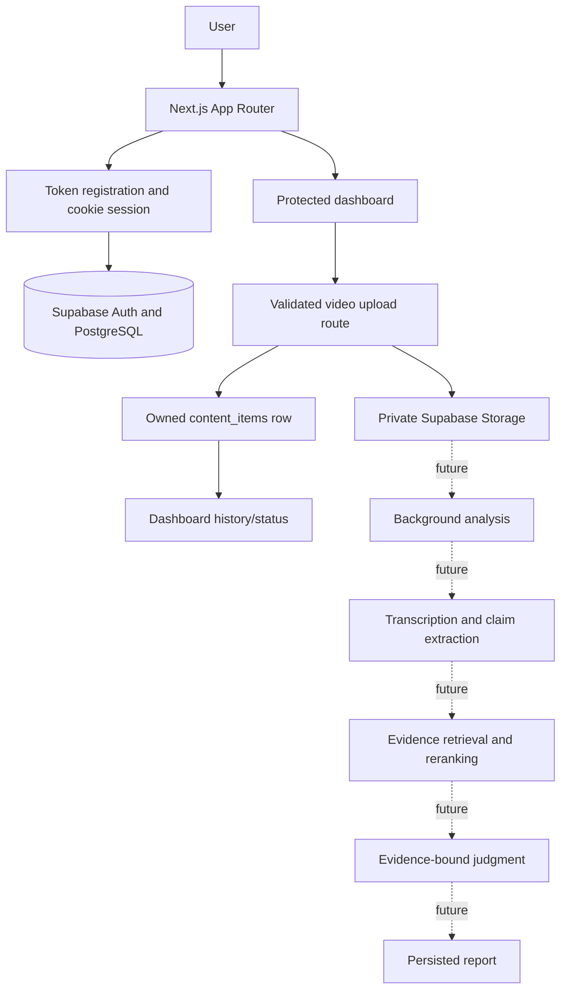

# Architecture

## Purpose and principles

Psych Factcheck is a modular monolith for evidence-grounded analysis of psychological video content. The MVP optimizes for simplicity, maintainability, testability, and replaceable external providers. Retrieval and judgment are separate trust boundaries: a model may judge only the supplied Evidence Package; it is never treated as a source of truth.

## Stack and deployment

- Next.js App Router and strict TypeScript for the web application and server code
- React for UI, Zod for runtime validation
- Supabase PostgreSQL, Auth, and private Storage (current); pgvector is future scope
- Trigger.dev for durable background workflows (future scope)
- Vitest, Playwright, ESLint, and Prettier
- pnpm for package management
- Next.js toolchain plus an experimental Vinext/Vite/Cloudflare Workers target

The current app is a Next.js modular monolith backed by Supabase. Standard Next.js scripts coexist with an experimental Vinext/Vite/Cloudflare Worker path (`dev:vinext`, `build:vinext`, `start:vinext`, `deploy:vinext`). The Cloudflare path is present in configuration but is not represented here as a production-verified deployment. No separate Python backend, Redis/Celery queue, Docker/Kubernetes stack, or external vector database is used. Trigger.dev, pgvector, and AI providers are not connected.

## System flow

## Frontend and server boundaries

`src/app` owns routes, layouts, server actions/route handlers, and rendering. `src/components` contains shared presentation components. `src/features` groups feature-specific UI and orchestration. Browser code receives only the minimum public data and never imports privileged clients or secrets. Current routes include the auth entry at `/`, protected `/dashboard`, `/api/uploads/video`, and static/interactive UI previews under `/ui-preview/*`; the previews do not constitute the persisted report/analysis workflow.

`src/server` owns provider adapters, repositories, evidence retrieval, storage operations, billing authorization, and workflows. Business logic depends on domain contracts rather than vendor SDKs. `src/lib` is reserved for genuinely shared utilities; `src/types` holds stable cross-cutting domain types. `src/lib/supabase/browser.ts` is the sole browser client entry point. Authentication uses a server-generated access token with Supabase Auth cookie sessions through `@supabase/ssr`; a server-only token-digest mapping resolves the token to its Auth identity. `src/proxy.ts` refreshes dashboard sessions, while each protected page independently validates claims on the server. `src/server/supabase/server.ts` retains the explicit bearer-token client for non-browser user-context operations, while `src/server/supabase/admin.ts` is `server-only` and reserved for explicitly privileged operations.

## Provider architecture

External services sit behind these contracts:

- `LLMProvider`: claim extraction and evidence-bound judgment
- `TranscriptionProvider`: timestamped transcription
- `EmbeddingProvider`: text vectors
- `ContentProvider`: future external content acquisition
- `BillingProvider`: future checkout and subscription operations

Composition belongs in a server-only application boundary. UI and domain services should never call vendor SDKs directly. Current contracts exist under `src/server/ai/providers.ts`, `src/server/content/provider.ts`, and `src/server/billing/contracts.ts`; there are no real LLM, transcription, embedding, content, or billing adapters yet. The existing Supabase integration is infrastructure, not an AI provider implementation.

## Supabase boundary

Supabase currently provides Auth, PostgreSQL, and private video Storage. Migrations create `profiles`, `content_items`, `analysis_jobs`, token-digest tables, and the `videos` bucket with ownership policies. The app includes generated-token registration/login, cookie sessions, a private upload route, and owner-filtered dashboard listing. No analysis job is currently created by the upload path; `analysis_jobs` is schema-only. RLS, admin/client boundaries, local setup, and tests are documented in [Supabase foundation](docs/architecture/SUPABASE.md) and [Authentication](docs/architecture/AUTH.md).

## Workflow boundary

No background runner is currently connected. The upload route persists the media and content row, but it does not enqueue `analysis_jobs` or update it through a processing lifecycle. A future Trigger.dev workflow must be idempotent, retry only safe steps, persist state transitions, and distinguish transient from permanent failures.

## AI and Evidence Base

The intended AI pipeline is detailed in `docs/architecture/AI_PIPELINE.md`. Only provider interfaces and verdict types exist. There is no transcription, embedding, retrieval, reranking, judgment, or report-generation runtime. When implemented, structured outputs must be parsed as `unknown` and validated with Zod; retrieved text is untrusted data, never instructions.

There are no `sources`, `evidence_chunks`, or fact-check persistence tables yet. The future Evidence Base must use real source metadata and traceable chunks; retrieval may use pgvector and metadata filters, followed by reranking. Judgment receives a bounded Evidence Package, and every cited identifier must resolve to a real stored source.

## Billing abstraction

Runtime access is decided by `EntitlementService` and `UsageService`, never vendor subscription objects. `BillingProvider` is an adapter boundary; Stripe may be one future implementation. See `docs/architecture/BILLING.md`.

## Domain overview

Core domains are identity (`profiles`), content (`content_items`, `transcripts`), fact checking (`claims`, `sources`, `evidence_chunks`, `fact_checks`, `fact_check_evidence`), orchestration (`analysis_jobs`), and commercial access (`plans`, `subscriptions`, `billing_customers`, `entitlements`, `usage_events`). Ownership and lifecycle are specified in `docs/architecture/DATA_MODEL.md`.

## Scaling principles

Keep the modular monolith until measured constraints justify change. First complete the analysis lifecycle and make the current upload/status behavior explicit; later scale background concurrency through a durable workflow runner, add pgvector inside PostgreSQL, and version prompts/schemas/eval datasets. Introduce caching, partitioning, or a separate service only in response to observed constraints. Preserve provider contracts and repository boundaries so adapters can change without rewriting business logic.

## Product UI and design references

`UI_FOUNDATION.md` at the repository root defines the visual source of truth and is linked from `AGENTS.md`. Screen reference PNGs are catalogued in `docs/design/README.md`. `/ui-preview/*` pages are implementation prototypes, not all production-backed flows. Reconcile their visual implementation with the approved Figma/Preline foundation before treating them as accepted product UI.
