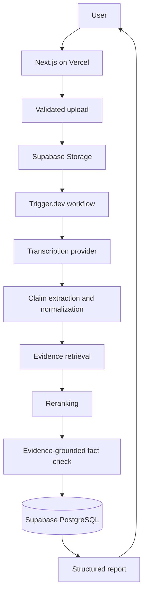

# Architecture

## Purpose and principles

Psych Factcheck is a modular monolith for evidence-grounded analysis of psychological video content. The MVP optimizes for simplicity, maintainability, testability, and replaceable external providers. Retrieval and judgment are separate trust boundaries: a model may judge only the supplied Evidence Package; it is never treated as a source of truth.

## Stack and deployment

- Next.js App Router and strict TypeScript for the web application and server code
- React for UI, Zod for runtime validation
- Supabase PostgreSQL, pgvector, Auth, and Storage (introduced in later sessions)
- Trigger.dev for durable background workflows (introduced later)
- Vitest, Playwright, ESLint, and Prettier
- pnpm for package management; Vercel for the web deployment

The initial deployment is one Next.js application on Vercel, one Supabase project, and Trigger.dev. There is no separate backend, queue, cache, or vector database.

## System flow

## Frontend and server boundaries

`src/app` owns routes, layouts, server actions/route handlers, and rendering. `src/components` contains shared presentation components. `src/features` groups feature-specific UI and orchestration. Browser code receives only the minimum public data and never imports server providers, database clients, or secrets.

`src/server` owns provider adapters, repositories, evidence retrieval, storage operations, billing authorization, and workflows. Business logic depends on domain contracts rather than vendor SDKs. `src/lib` is reserved for genuinely shared utilities; `src/types` holds stable cross-cutting domain types. `src/lib/supabase/browser.ts` is the sole browser client entry point. Authentication uses a server-generated access token with Supabase Auth cookie sessions through `@supabase/ssr`; a server-only token-digest mapping resolves the token to its Auth identity. `src/proxy.ts` refreshes dashboard sessions, while each protected page independently validates claims on the server. `src/server/supabase/server.ts` retains the explicit bearer-token client for non-browser user-context operations, while `src/server/supabase/admin.ts` is `server-only` and reserved for explicitly privileged operations.

## Provider architecture

External services sit behind these contracts:

- `LLMProvider`: claim extraction and evidence-bound judgment
- `TranscriptionProvider`: timestamped transcription
- `EmbeddingProvider`: text vectors
- `ContentProvider`: future external content acquisition
- `BillingProvider`: future checkout and subscription operations

Composition happens in a server-only application boundary. UI and domain services never call vendor SDKs directly. Adapters validate provider responses, map vendor errors into application errors, enforce timeouts, and expose observability metadata without leaking secrets. Session 0 defines contracts only; it intentionally includes no fake provider or production adapter.

## Supabase boundary

Supabase provides the current PostgreSQL/Auth foundation and will later provide pgvector search and private video storage. User-owned rows require Row Level Security plus server-side ownership checks. The service-role key remains server-only. The initial schema provides `profiles`, `content_items`, and `analysis_jobs`; it does not yet include UI authentication, uploads, Storage, jobs, or AI. See [Supabase foundation](docs/architecture/SUPABASE.md).

## Workflow boundary

Trigger.dev will coordinate the long-running analysis state machine. Jobs must be idempotent, retry only safe steps, persist state transitions, and distinguish transient from permanent failures. The Next.js request starts a job and returns promptly; UI reads persisted status rather than holding an HTTP connection open.

## AI and Evidence Base

The AI pipeline is detailed in `docs/architecture/AI_PIPELINE.md`. Structured outputs are parsed as `unknown` and validated with Zod before use. Retrieved text is data, never instructions; prompts delimit it and reject embedded directives.

The Evidence Base stores real source metadata and traceable chunks. Retrieval uses pgvector plus metadata filters, then reranking. Judgment receives a bounded Evidence Package with source/chunk identifiers. Every cited identifier must be present in that package and resolve to a real stored source.

## Billing abstraction

Runtime access is decided by `EntitlementService` and `UsageService`, never vendor subscription objects. `BillingProvider` is an adapter boundary; Stripe may be one future implementation. See `docs/architecture/BILLING.md`.

## Domain overview

Core domains are identity (`profiles`), content (`content_items`, `transcripts`), fact checking (`claims`, `sources`, `evidence_chunks`, `fact_checks`, `fact_check_evidence`), orchestration (`analysis_jobs`), and commercial access (`plans`, `subscriptions`, `billing_customers`, `entitlements`, `usage_events`). Ownership and lifecycle are specified in `docs/architecture/DATA_MODEL.md`.

## Scaling principles

Keep the modular monolith until measured constraints justify change. Scale background concurrency independently through Trigger.dev, grow PostgreSQL/pgvector with appropriate indexes and filtered searches, and version prompts/schemas/eval datasets. Introduce caching, partitioning, or a separate service only in response to observed performance or reliability needs. Preserve provider contracts and repository boundaries so adapters can change without rewriting business logic.
