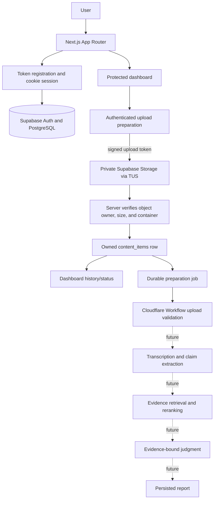

# Architecture

## Purpose and principles

Psych Factcheck is a modular monolith for evidence-grounded analysis of psychological video content. The MVP optimizes for simplicity, maintainability, testability, and replaceable external providers. Retrieval and judgment are separate trust boundaries: a model may judge only the supplied Evidence Package; it is never treated as a source of truth.

## Stack and deployment

- Next.js App Router and strict TypeScript for the web application and server code
- React for UI, Zod for runtime validation
- Supabase PostgreSQL, Auth, and private Storage (current); pgvector is future scope
- Cloudflare Workflows and a Worker cron for the Session 5 non-AI preparation workflow (local implementation; production verification pending)
- Vitest, Playwright, ESLint, and Prettier
- pnpm for package management
- Next.js toolchain plus an experimental Vinext/Vite/Cloudflare Workers target

The current app is a Next.js modular monolith backed by Supabase. Standard Next.js scripts coexist with a Vinext/Vite/Cloudflare Worker path (`dev:vinext`, `build:vinext`, `start:vinext`, `deploy:vinext`), which has been deployed to the project's `workers.dev` address. The Cloudflare Worker hosts the app, durable background workflow, and scheduled recovery; Supabase remains the source of truth for jobs and content. Production has the workflow binding and minute cron; the dashboard records one completed Workflow instance. Verification of the corresponding persisted job state and fresh browser upload/retry flows remains. No separate Python backend, Redis/Celery queue, Docker/Kubernetes stack, or external vector database is used. pgvector and AI providers are not connected.

## System flow

```mermaid
flowchart TD
  U[User] --> WEB[Next.js App Router]
  WEB --> AUTH[Token registration and cookie session]
  AUTH --> DB[(Supabase Auth and PostgreSQL)]
  WEB --> DASH[Protected dashboard]
  DASH --> UP[Authenticated upload preparation]
  UP -->|signed upload token| STORAGE[Private Supabase Storage via TUS]
  STORAGE --> VERIFY[Server verifies object owner, size, and container]
  VERIFY --> CONTENT[Owned content_items row]
  CONTENT --> HISTORY[Dashboard history/status]
  CONTENT --> JOB[Durable preparation job]
  JOB --> PREP[Cloudflare Workflow upload validation]
  PREP -. future .-> TRANS[Transcription and claim extraction]
  TRANS -. future .-> RAG[Evidence retrieval and reranking]
  RAG -. future .-> JUDGE[Evidence-bound judgment]
  JUDGE -. future .-> REPORT[Persisted report]
```

## Frontend and server boundaries

`src/app` owns routes, layouts, server actions/route handlers, and rendering. `src/components` contains shared presentation components. `src/features` groups feature-specific UI and orchestration. Browser code receives only the minimum public data and never imports privileged clients or secrets. Current routes include auth at `/` and `/auth`, the protected persisted dashboard at `/dashboard`, `/api/uploads/video` and its completion handler, `/api/analysis`, and UI sections at `/history`, `/new-check`, `/processing`, `/report`, and `/profile`. Video bytes travel directly from the browser to private Supabase Storage using signed TUS uploads at `/storage/v1/upload/resumable/sign`; a root-layout upload provider keeps the in-flight task alive across client-side route navigation. A full page reload interrupts byte transfer, but the same tab restores a paused upload screen from `sessionStorage`. On supported secure-context browsers, the app stores only a user-granted file handle in IndexedDB; pressing Continue reacquires the file and resumes from the browser's stored TUS URL while that URL is valid. The video bytes are not copied into browser storage. If handle access is unsupported or permission is denied, the user must select the source file again. Bytes are not transferred while the page is unloaded. Server handlers prepare a constrained signed upload and validate the completed object before creating `content_items`. Session 5 displays persisted preparation-job status after upload and on `/processing?contentItemId=...`; AI stages remain pending. Other prototype pages do not constitute the persisted report/analysis workflow; legacy `/ui-preview/*` URLs redirect to the corresponding clean paths.

`src/server` owns provider adapters, repositories, evidence retrieval, storage operations, billing authorization, and workflows. Business logic depends on domain contracts rather than vendor SDKs. `src/lib` is reserved for genuinely shared utilities; `src/types` holds stable cross-cutting domain types. `src/lib/supabase/browser.ts` is the sole browser client entry point. Authentication uses a server-generated access token with Supabase Auth cookie sessions through `@supabase/ssr`; a server-only token-digest mapping resolves the token to its Auth identity. `src/proxy.ts` refreshes dashboard sessions, while each protected page independently validates claims on the server. `src/server/supabase/server.ts` retains the explicit bearer-token client for non-browser user-context operations, while `src/server/supabase/admin.ts` is `server-only` and reserved for explicitly privileged operations.

## Provider architecture

External services sit behind these contracts:

- `LLMProvider`: claim extraction and evidence-bound judgment
- `TranscriptionProvider`: timestamped transcription
- `EmbeddingProvider`: text vectors
- `ContentProvider`: future external content acquisition
- `BillingProvider`: future checkout and subscription operations

Composition belongs in a server-only application boundary. UI and domain services should never call vendor SDKs directly. Current contracts exist under `src/server/ai/providers.ts`, `src/server/content/provider.ts`, and `src/server/billing/contracts.ts`; there are no real LLM, transcription, embedding, content, or billing adapters yet. The existing Supabase integration is infrastructure, not an AI provider implementation.

## Supabase boundary

Supabase currently provides Auth, PostgreSQL, and private video Storage. Migrations create `profiles`, `content_items`, `analysis_jobs`, token-digest tables, and the `videos` bucket with ownership policies. The app includes generated-token registration/login, cookie sessions, signed TUS upload preparation/finalization, and owner-filtered dashboard listing. The Session 5 migration adds atomic job creation on upload, owner-authorized request/retry and service-only lifecycle transitions. RLS, admin/client boundaries, local setup, and tests are documented in [Supabase foundation](docs/architecture/SUPABASE.md) and [Authentication](docs/architecture/AUTH.md).

## Workflow boundary

Session 5 adds a Cloudflare preparation workflow. A database trigger atomically queues an `analysis_jobs` row with each uploaded content row; a Worker cron and an owner-authorized API start or reconcile the workflow. Generation/run fencing protects retries and persisted progress. Completion means upload preparation only: content remains pending and AI/report stages do not run. The production binding, minute cron and one completed Workflow instance are visible in the Cloudflare dashboard; persisted job state and browser acceptance remain to be verified. See [Background workflows](docs/architecture/WORKFLOWS.md).

## AI and Evidence Base

The intended AI pipeline is detailed in `docs/architecture/AI_PIPELINE.md`. Only provider interfaces and verdict types exist. There is no transcription, embedding, retrieval, reranking, judgment, or report-generation runtime. When implemented, structured outputs must be parsed as `unknown` and validated with Zod; retrieved text is untrusted data, never instructions.

There are no `sources`, `evidence_chunks`, or fact-check persistence tables yet. The future Evidence Base must use real source metadata and traceable chunks; retrieval may use pgvector and metadata filters, followed by reranking. Judgment receives a bounded Evidence Package, and every cited identifier must resolve to a real stored source.

## Billing abstraction

Runtime access is decided by `EntitlementService` and `UsageService`, never vendor subscription objects. `BillingProvider` is an adapter boundary; Stripe may be one future implementation. See `docs/architecture/BILLING.md`.

## Domain overview

Core domains are identity (`profiles`), content (`content_items`, `transcripts`), fact checking (`claims`, `sources`, `evidence_chunks`, `fact_checks`, `fact_check_evidence`), orchestration (`analysis_jobs`), and commercial access (`plans`, `subscriptions`, `billing_customers`, `entitlements`, `usage_events`). Ownership and lifecycle are specified in `docs/architecture/DATA_MODEL.md`.

## Scaling principles

Keep the modular monolith until measured constraints justify change. First complete the analysis lifecycle and make the current upload/status behavior explicit; later scale background concurrency through a durable workflow runner, add pgvector inside PostgreSQL, and version prompts/schemas/eval datasets. Introduce caching, partitioning, or a separate service only in response to observed constraints. Preserve provider contracts and repository boundaries so adapters can change without rewriting business logic.

## Product UI and design references

`UI_FOUNDATION.md` at the repository root defines the visual source of truth and is linked from `AGENTS.md`. Screen reference PNGs are catalogued in `docs/design/README.md`. `/history`, `/new-check`, `/processing`, `/report`, and `/profile` are implementation prototypes, not all production-backed flows. Reconcile their visual implementation with the approved Figma/Preline foundation before treating them as accepted product UI.
