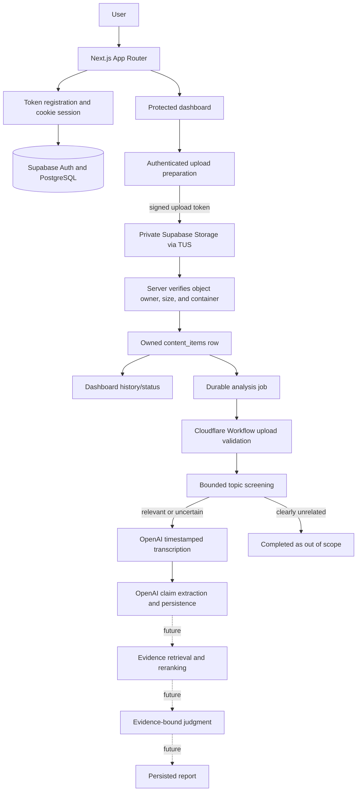

# Architecture

## Purpose and principles

Psych Factcheck is a modular monolith for evidence-grounded analysis of psychological video content. The MVP optimizes for simplicity, maintainability, testability, and replaceable external providers. Retrieval and judgment are separate trust boundaries: a model may judge only the supplied Evidence Package; it is never treated as a source of truth.

## Stack and deployment

- Next.js App Router and strict TypeScript for the web application and server code
- React for UI, Zod for runtime validation
- Supabase PostgreSQL, Auth, and private Storage (current); pgvector is future scope
- Cloudflare Workflows and a Worker cron (Session 6 OpenAI transcription is deployed and live-verified in Production)
- Vitest, Playwright, ESLint, and Prettier
- pnpm for package management
- Next.js toolchain plus an experimental Vinext/Vite/Cloudflare Workers target

The current app is a Next.js modular monolith backed by Supabase. Standard Next.js scripts coexist with a Vinext/Vite/Cloudflare Worker path (`dev:vinext`, `build:vinext`, `start:vinext`, `deploy:vinext`), deployed to the project's `workers.dev` address. The Cloudflare Worker hosts the app, durable background workflow, and scheduled recovery; Supabase remains the source of truth for jobs and content. Sessions 6–7 migrations and workflow stages are deployed. A Production job completed through claim extraction on 2026-09-30; the latest Worker version `fdd311f2-5cda-4d0b-bb3e-c448ccdb6955` also includes a topic-screening duration fallback and processing-screen feedback. A fresh off-topic upload is still needed to verify the screening fallback against the previously missed MP4 case; model-quality evaluation remains outstanding. No separate Python backend, Redis/Celery queue, Docker/Kubernetes stack, or external vector database is used. pgvector, retrieval, reranking, judgment, and report generation are not connected.

## System flow

```mermaid
flowchart TD
  U[User] --> WEB[Next.js App Router]
  WEB --> AUTH[Token registration and cookie session]
  AUTH --> DB[(Supabase Auth and PostgreSQL)]
  WEB --> DASH[Protected dashboard]
  DASH --> UP[Authenticated upload preparation]
  UP -->|signed upload token| STORAGE[Private Supabase Storage via TUS]
  STORAGE --> VERIFY[Server verifies object owner, size, and container]
  VERIFY --> CONTENT[Owned content_items row]
  CONTENT --> HISTORY[Dashboard history/status]
  CONTENT --> JOB[Durable analysis job]
  JOB --> PREP[Cloudflare Workflow upload validation]
  PREP --> SCREEN[Bounded topic screening]
  SCREEN -->|relevant or uncertain| TRANS[OpenAI timestamped transcription]
  SCREEN -->|clearly unrelated| STOP[Completed as out of scope]
  TRANS --> CLAIMS[OpenAI claim extraction and persistence]
  CLAIMS -. future .-> RAG[Evidence retrieval and reranking]
  RAG -. future .-> JUDGE[Evidence-bound judgment]
  JUDGE -. future .-> REPORT[Persisted report]
```

## Frontend and server boundaries

`src/app` owns routes, layouts, server actions/route handlers, and rendering. `src/components` contains shared presentation components. `src/features` groups feature-specific UI and orchestration. Browser code receives only the minimum public data and never imports privileged clients or secrets. Current routes include auth at `/` and `/auth`, the protected persisted dashboard at `/dashboard`, `/api/uploads/video` and its completion handler, `/api/analysis`, and UI sections at `/history`, `/new-check`, `/processing`, `/report`, and `/profile`. Video bytes travel directly from the browser to private Supabase Storage using signed TUS uploads at `/storage/v1/upload/resumable/sign`; a root-layout upload provider keeps the in-flight task alive across client-side route navigation. A full page reload interrupts byte transfer; once the client restores state, the same tab shows the paused progress screen rather than the new-upload form or a transient analysis-stage screen. On supported secure-context browsers, the app stores only a user-granted file handle in IndexedDB; pressing Continue reacquires the file and resumes from the browser's stored TUS URL while that URL is valid. The video bytes are not copied into browser storage. If handle access is unsupported or permission is denied, the user must select the original file again. Cancel clears an active or interrupted upload and unlocks selection of a new file; while TUS is active it also aborts the client request and asks TUS to terminate the partial upload. Bytes are not transferred while the page is unloaded. Server handlers prepare a constrained signed upload and validate the completed object before creating `content_items`. Sessions 6A–7 display persisted screening, transcription, and claim-extraction progress after upload and on `/processing?contentItemId=...`; retrieval, judgment, and report stages remain pending. A Production job completed through claim extraction on 2026-09-30; a fresh upload is still required to verify the screening duration fallback on the MP4 that previously failed sample extraction. Other prototype pages do not constitute the persisted report/analysis workflow; legacy `/ui-preview/*` URLs redirect to the corresponding clean paths.

`src/server` owns provider adapters, repositories, evidence retrieval, storage operations, billing authorization, and workflows. Business logic depends on domain contracts rather than vendor SDKs. `src/lib` is reserved for genuinely shared utilities; `src/types` holds stable cross-cutting domain types. `src/lib/supabase/browser.ts` is the sole browser client entry point. Authentication uses a server-generated access token with Supabase Auth cookie sessions through `@supabase/ssr`; a server-only token-digest mapping resolves the token to its Auth identity. `src/proxy.ts` refreshes dashboard sessions, while each protected page independently validates claims on the server. `src/server/supabase/server.ts` retains the explicit bearer-token client for non-browser user-context operations, while `src/server/supabase/admin.ts` is `server-only` and reserved for explicitly privileged operations.

## Provider architecture

External services sit behind these contracts:

- `ClaimExtractionProvider`: OpenAI claim extraction with versioned prompt/schema
- `LLMProvider`: evidence-bound judgment (future; not connected)
- `TranscriptionProvider`: timestamped transcription (OpenAI `whisper-1` adapter implemented for Session 6)
- `EmbeddingProvider`: text vectors
- `ContentProvider`: future external content acquisition
- `BillingProvider`: future checkout and subscription operations

Composition belongs in a server-only application boundary. UI and domain services should never call vendor SDKs directly. The OpenAI transcription, topic-screening, and claim-extraction adapters are server-only and used by the Cloudflare Worker workflow. Claim extraction uses `gpt-4o-mini` structured output, validates each source excerpt against the transcript, and stores the model, prompt, and schema versions with an idempotent extraction record. Embedding, content, and billing adapters are not implemented. Topic screening demuxes at most three four-second ranges from the compressed audio track with Mediabunny, then calls OpenAI transcription and structured text classification. When audio-track duration is absent from container metadata, Mediabunny computes it from encoded packet timestamps. Unsupported samples, low-confidence decisions, and screening errors fail open to full transcription. The screening instruction/model versions and bounded decision metadata are persisted without the sample transcript.

## Supabase boundary

Supabase currently provides Auth, PostgreSQL, and private video Storage. Migrations create `profiles`, `content_items`, `analysis_jobs`, token-digest tables, and the `videos` bucket with ownership policies. The app includes generated-token registration/login, cookie sessions, signed TUS upload preparation/finalization, and owner-filtered dashboard listing. The Session 5 migration adds atomic job creation on upload, owner-authorized request/retry and service-only lifecycle transitions. RLS, admin/client boundaries, local setup, and tests are documented in [Supabase foundation](docs/architecture/SUPABASE.md) and [Authentication](docs/architecture/AUTH.md).

## Workflow boundary

Sessions 6A–7 add bounded topic screening, timestamped transcription, then OpenAI claim extraction in the same generation/run-fenced Cloudflare Workflow. High-confidence off-topic videos complete with `VIDEO_OUT_OF_SCOPE`; uncertain or failed screening continues to transcription. MP4/WebM files up to 25 MB are transcribed with OpenAI `whisper-1`; `gpt-4o-mini` returns structured claims whose source excerpts are checked against the transcript. Validated claims are persisted; evidence and report stages remain unimplemented. This workflow is deployed, and a Production job completed through claim extraction on 2026-09-30. The processing screen listens for persisted Realtime updates, shows an animated activity marker while a job is queued/running, and presents screened-out results as a warning Alert. A new upload remains necessary to live-verify the duration fallback on the MP4 that previously failed sampling. See [Background workflows](docs/architecture/WORKFLOWS.md), [Session 6 verification](docs/testing/SESSION_6.md), [Session 6A verification](docs/testing/SESSION_6A.md), and [Session 7 verification](docs/testing/SESSION_7.md).

## AI and Evidence Base

The intended AI pipeline is detailed in `docs/architecture/AI_PIPELINE.md`. OpenAI transcription and the end-to-end claim-extraction workflow have completed Production jobs. Earlier claim-source validation failures led to fixes deployed on 2026-09-30; successful job completion does not establish model quality. Embedding, retrieval, reranking, judgment, and report generation are not connected. Structured outputs must be parsed as `unknown` and validated with Zod; transcript and retrieved text are untrusted data, never instructions.

There are no `sources`, `evidence_chunks`, or fact-check persistence tables yet. The future Evidence Base must use real source metadata and traceable chunks; retrieval may use pgvector and metadata filters, followed by reranking. Judgment receives a bounded Evidence Package, and every cited identifier must resolve to a real stored source.

## Billing abstraction

Runtime access is decided by `EntitlementService` and `UsageService`, never vendor subscription objects. `BillingProvider` is an adapter boundary; Stripe may be one future implementation. See `docs/architecture/BILLING.md`.

## Domain overview

Core domains are identity (`profiles`), content (`content_items`, `transcripts`), fact checking (`claims`, `sources`, `evidence_chunks`, `fact_checks`, `fact_check_evidence`), orchestration (`analysis_jobs`), and commercial access (`plans`, `subscriptions`, `billing_customers`, `entitlements`, `usage_events`). Ownership and lifecycle are specified in `docs/architecture/DATA_MODEL.md`.

## Scaling principles

Keep the modular monolith until measured constraints justify change. First complete the analysis lifecycle and make the current upload/status behavior explicit; later scale background concurrency through a durable workflow runner, add pgvector inside PostgreSQL, and version prompts/schemas/eval datasets. Introduce caching, partitioning, or a separate service only in response to observed constraints. Preserve provider contracts and repository boundaries so adapters can change without rewriting business logic.

## Product UI and design references

`UI_FOUNDATION.md` at the repository root defines the visual source of truth and is linked from `AGENTS.md`. Screen reference PNGs are catalogued in `docs/design/README.md`. `/history`, `/new-check`, `/processing`, `/report`, and `/profile` are implementation prototypes, not all production-backed flows. Reconcile their visual implementation with the approved Figma/Preline foundation before treating them as accepted product UI.
