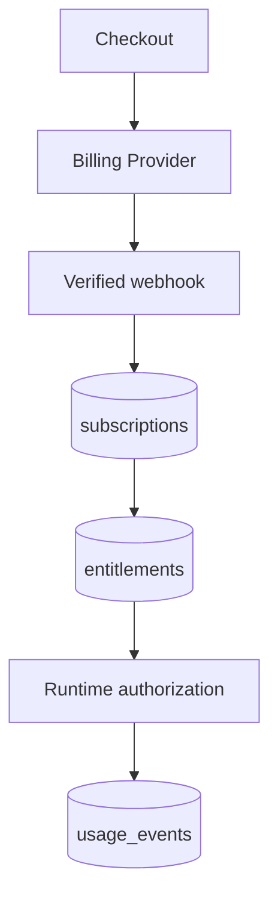

# Billing and Access Architecture

Payments are post-MVP. The MVP introduces access concepts without connecting Stripe or another real billing service.

## Responsibilities

- `BillingProvider` translates provider checkout, customer, subscription, cancellation, and webhook operations into stable application events.
- `EntitlementService` answers whether a user may access a named capability at runtime.
- `UsageService` checks limits and records idempotent usage events.

Business logic asks `hasEntitlement(userId, "profile_analysis")` or `canRunAnalysis(userId)`; it never inspects a Stripe plan or vendor subscription object.

## Future flow

Webhook handlers verify signatures, store provider event IDs for idempotency, persist normalized subscription state, and recompute entitlements transactionally. Webhook arrival order cannot be trusted. Runtime authorization reads local normalized state rather than calling the provider on every request.

## Entities and lifecycle

`plans` define internal product offerings; `billing_customers` map users to opaque provider customer IDs; `subscriptions` normalize provider state; `entitlements` represent capabilities and limits with effective dates; `usage_events` form an append-only audit trail. Provider-specific fields remain in adapter metadata and never control domain behavior directly.

## Security and reliability

Billing credentials and webhook secrets are server-only. Users cannot grant their own entitlements. Usage recording must be idempotent and concurrency-safe so parallel analysis starts cannot exceed a limit. Cancellation and provider outages require explicit states and reconciliation jobs. A real provider is implemented only after a separate product decision.
